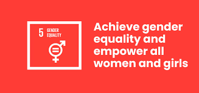

# Archivit
#### Project of 2024 google solution challenge


---
## MEMBERS
| Ko EunJin | Lee Sunggu  | Lim ChaeHyeong | Lao ChingSan |
|---|---|---|---|
| Lead / Design | Frontend / Backend | Frontend | AI / Frontend |
| KOR | KOR | KOR | CAM |
---
## Targeting of UN - SDGs
#### Goal 3. Good Health & Well-Being

  

#### About our solution 
In our current korea society, various incidents of violence have emerged as a serious social issue. The Archivit app aims to help vulnerable individuals live a healthy life without worrying about tomorrow amid these incidents.

We provide users with an AI-powered recording feature to adopt evidence of violence when they are exposed to such situations. Even in situations where victims cannot manually record, AI recognizes the violent situation and automatically proceeds with recording, which can be immensely helpful for victims in legal proceedings.

We offer information on how victims of verbal and physical violence can receive assistance and overcome their situations. Through various platforms where victims can seek redress, we make it easy to find information that may have been difficult to obtain through internet searches.

Furthermore, we provide a template feature that allows victims to record their daily experiences. Through this feature, victims can document events in writing, enabling them to adopt more accurate evidence and alleviate stress by expressing concerns they may not have been able to share with anyone before.

Finally, when used as evidence, we have added a feature that utilizes AI to convert voice recordings into text, making past situations easier to report and understand. Through these measures, we believe that victims of violence can resolve problematic situations without injustice.

___

## App Overview


todo


---

## How to Start

#### Frontend
You should install Flutter.
(My Version: Flutter SDK: 3.19.0 , Dart: 3.3.0)

Our Flutter project is only available for use in the iOS environment.
So before, command 'flutter run'. Please, Launch the IOS Emulator or connect with IOS phone.

```
flutter run // and choose IOS Platform.
```
#### Backend
You should install Go.(My Version: go1.21.5)

Go to the main.go directory.


```
docker compose up -d
go run main.go
```

#### AI


---


## About Implement
#### Tech Stack
###### Frontend 
* Flutter 
* Getx
* flutter_sound
* flutter_background_service 
* etc

###### Backend
* Golang
* Gin-Gonic
* Gorm
* Swagger
* Mysql
* GCP App Engine


###### AI


#### Project Architecture


#### Server URL 

* [Backend API Docs](https://agile-dev-dot-primeval-span-410215.du.r.appspot.com/swagger/index.html#/)

* [AI API Docs](https://final-apcfknrtba-du.a.run.app/docs)

----
## Improvement things

#### Frontend 

#### Backend


#### AI


#### Planning

----
## FeedBack
<!-- - It would be very nice to write history of what you are thinking and hard to implement during this project. (Gdsc tell this part is important.) -->
<!-- If the project had been carried out in this way upon completion, it would have been even better. -->


#### Frontend 

#### Backend


#### AI


#### Planning


