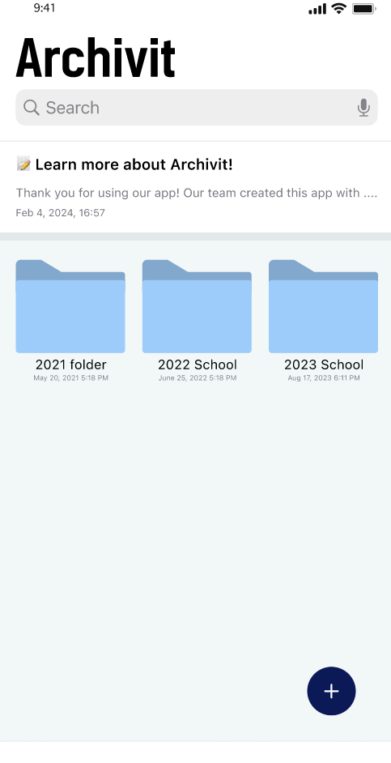
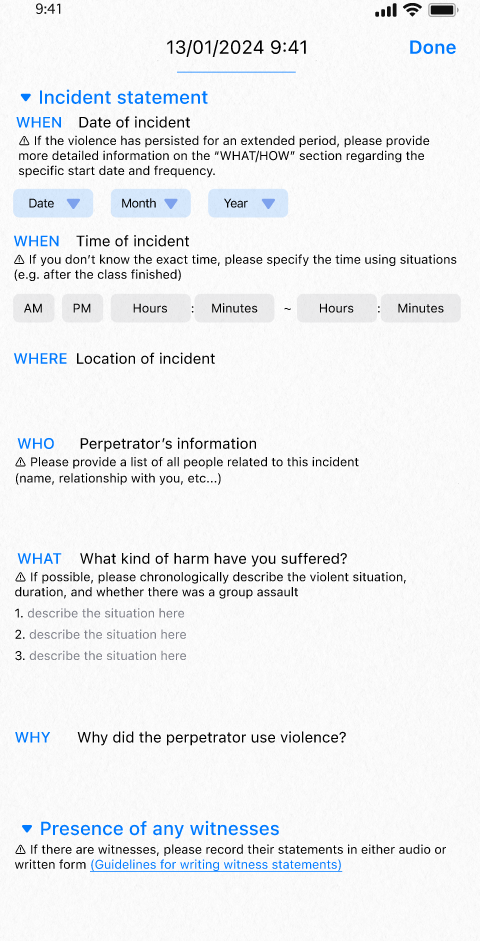
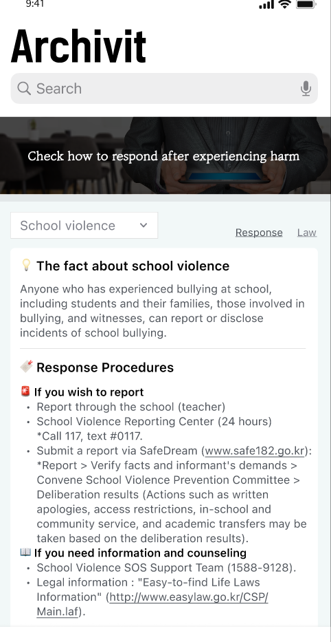
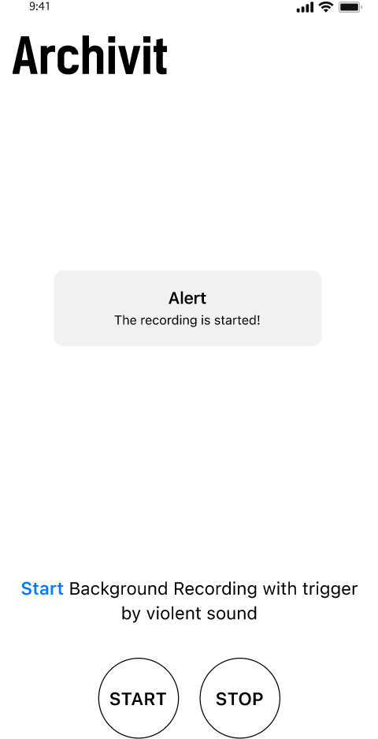
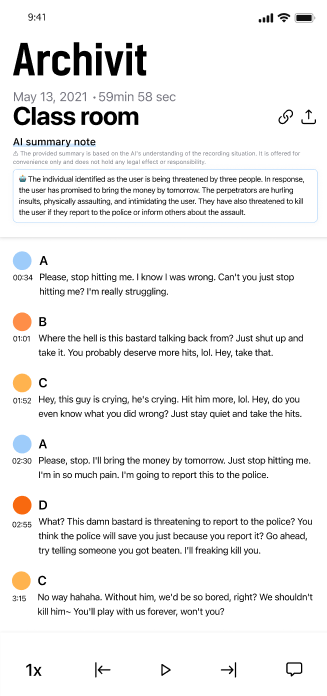

# Archivit
#### Project of 2024 google solution challenge


## MEMBERS
| Ko EunJin | Lee Sunggu  | Lim ChaeHyeong | Lao ChingSan |
|---|---|---|---|
| Lead / Design | Frontend / Backend | Frontend | AI / Frontend |
| KOR | KOR | KOR | CAM |
---
## Targeting of UN - SDGs
#### Goal 3. Good Health & Well-Being

  

#### About our solution 
In our current korea society, various incidents of violence have emerged as a serious social issue. The Archivit app aims to help vulnerable individuals live a healthy life without worrying about tomorrow amid these incidents.

We provide users with an AI-powered recording feature to adopt evidence of violence when they are exposed to such situations. Even in situations where victims cannot manually record, AI recognizes the violent situation and automatically proceeds with recording, which can be immensely helpful for victims in legal proceedings.

We offer information on how victims of verbal and physical violence can receive assistance and overcome their situations. Through various platforms where victims can seek redress, we make it easy to find information that may have been difficult to obtain through internet searches.

Furthermore, we provide a template feature that allows victims to record their daily experiences. Through this feature, victims can document events in writing, enabling them to adopt more accurate evidence and alleviate stress by expressing concerns they may not have been able to share with anyone before.

Finally, when used as evidence, we have added a feature that utilizes AI to convert voice recordings into text, making past situations easier to report and understand. Through these measures, we believe that victims of violence can resolve problematic situations without injustice.

___

## App Overview










---


## How to Start

#### Frontend
You should install Flutter.
(My Version: Flutter SDK: 3.19.0 , Dart: 3.3.0)

Our Flutter project is only available for use in the iOS environment.
So before, command 'flutter run'. Please, Launch the IOS Emulator or connect with IOS phone.

```
flutter run // and choose IOS Platform.
```
#### Backend
You should install Go.(My Version: go1.21.5)

Go to the main.go directory.


```
docker compose up -d
go run main.go
```

#### AI
To run this project, you need Python 3.7 or newer. It's recommended to use a virtual environment.

1. Install google-generativeai package:

```
pip install -q -U google-generativeai
```

2. Install dependencies:
```
pip install -r requirements.txt
```
Requirements
- FastAPI
- PyTorch
- Transformers
- Pydub
- Soynlp
- Pyannote.audio
- Google Cloud Generative AI services (for summarization)
- Librosa

Ensure you have the necessary API keys and tokens for services such as Hugging Face and Google Cloud.

3. Start the server with:
```
uvicorn main:app --reload
```
Endpoints
POST /violent-speech-detection/: Detects violent content in the speech.
POST /calm-situation-detection/: Identifies calm situations from audio.
POST /transcribe/: Performs speaker diarization and transcription.
POST /summarize/: Summarizes the provided text.

---


## About Implement
#### Tech Stack
###### - Frontend 
* Flutter 
* Getx
* flutter_sound
* flutter_background_service 
* etc

###### - Backend
* Golang
* Gin-Gonic
* Gorm
* Swagger
* Mysql
* GCP App Engine


###### - AI
* FastAPI: For building efficient, asynchronous REST APIs that serve our machine learning models.
* PyTorch & Transformers: For loading and serving state-of-the-art NLP and audio processing models.
* Librosa & Pydub: For audio file manipulation and format conversion.
* TensorFlow & Hugging Face Pipelines: For emotion detection and speaker diarization.

#### Project Architecture


#### Server URL 

* [Backend API Docs](https://agile-dev-dot-primeval-span-410215.du.r.appspot.com/swagger/index.html#/)

* [AI API Docs](https://final-apcfknrtba-du.a.run.app/docs)

----
## Improvement things

#### Planning


#### Frontend 

#### Backend


#### AI
* Enhance Model Accuracy: Continually retrain models with diverse, updated datasets to improve recognition accuracy and reduce bias.

* Increase Processing Speed: Use model optimization techniques like quantization and parallel processing to ensure real-time performance even under high load.

* Strengthen Privacy and Security: Implement voice anonymization and secure data handling to protect user privacy and data integrity.

* Expand Features and Languages: Develop context-aware models and broaden language support to cater to a global user base.


----
## FeedBack
<!-- - It would be very nice to write history of what you are thinking and hard to implement during this project. (Gdsc tell this part is important.) -->
<!-- If the project had been carried out in this way upon completion, it would have been even better. -->


#### Planning


#### Frontend 

#### Backend


#### AI
During the development of our project for the 2024 Google Solution Challenge, choosing the right AI model and integrating it with our app were our main challenges. Balancing accuracy with efficiency and scalability required careful consideration, as we aimed for a solution that offered real-world reliability without compromising performance. The integration process demanded a meticulous approach to ensure seamless communication between our AI API and the app, prioritizing user experience. This journey taught us the importance of adaptability and the value of community feedback in navigating technical challenges, reinforcing our commitment to continuous improvement and innovation in our quest to make a meaningful impact.

#Thank you
